# Graduator

Graduator is an iOS application developed with SwiftUI that helps users manage their academic `units`, `subjects`, and grades. Users can add and delete `subjects`, edit the weight and name of `subjects` and `units`, and input grades. The app displays weighted averages and explains the conditions for graduating from the Clermont Auvergne Tech Institute's mobile development BSc in 2023.

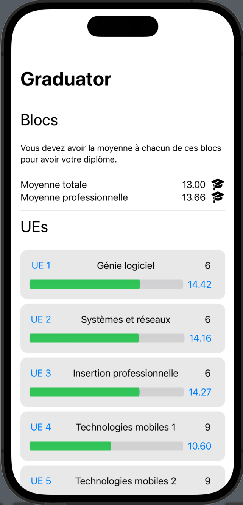
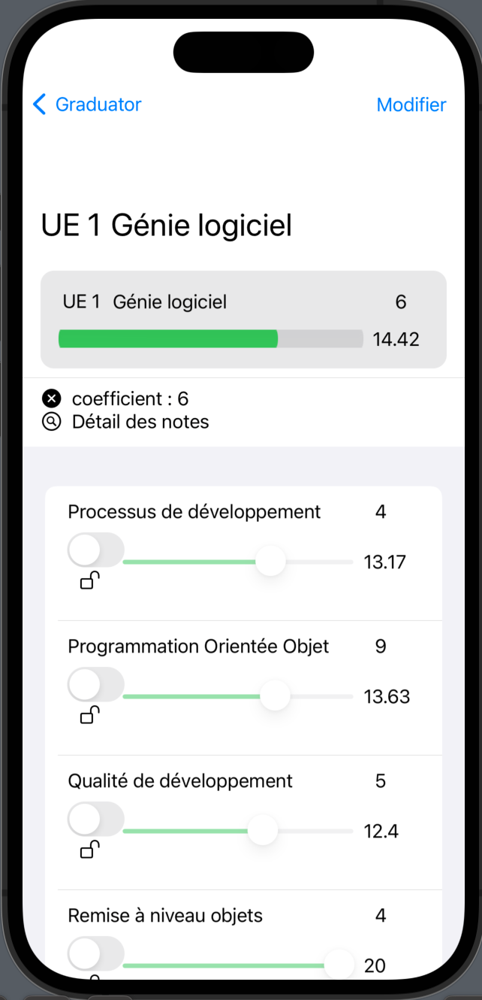
  
## Features

Beyond those basic features, some details need to be specified here.

### Persistence

The data is set to be persisted, unless you're using XCode's previewer canvas. 

The local persistence solution has been tested manually on the iOS Simulator.

Upon first launching the app, it is set up to load a stub.

### Weighted average

A weighted average means that a `subject` or `unit`'s weight plays a part in calculating the average. Users can observe that increasing the weight of a `subject`, for instance, will make the average of the parent `unit` tend more towards that `subject`'s grade.

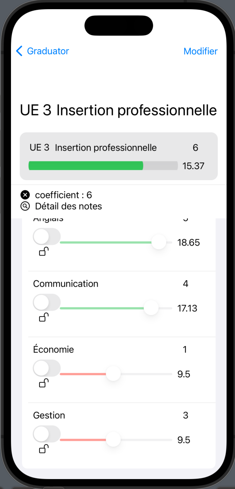

### Deleting a `Subject`

In the app, users can delete a `subject` by swiping it off the list, right-to-left.

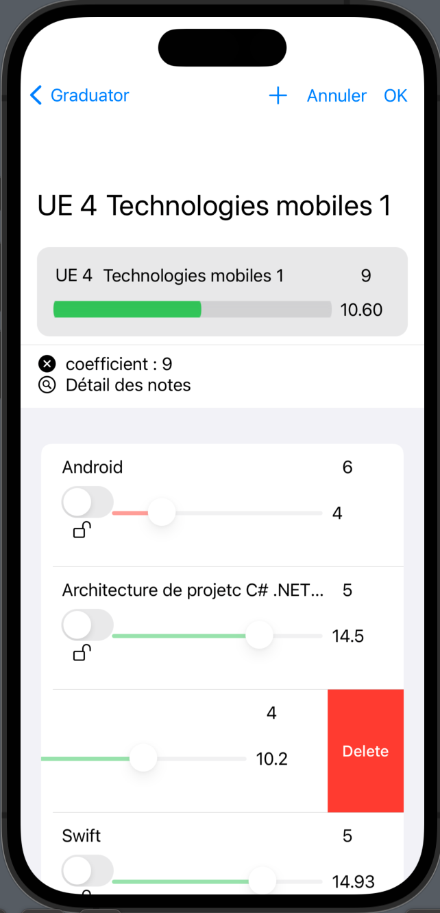
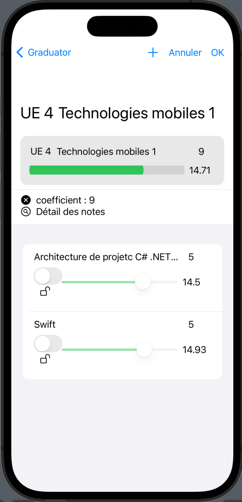

Note that when a `subject` is deleted, it is permanently removed from the system. If a user is in the process of editing and deletes a `subject`, the deletion occurs immediately upon swiping, not when they save (click 'OK'). If the user chooses to cancel their edits (click *'Annuler'*), all other unsaved changes will be discarded, but the deletion of the `subject` remains.

### Changing a grade

Before a user changes a grade, they first need to activate the `lock.open` toggle.

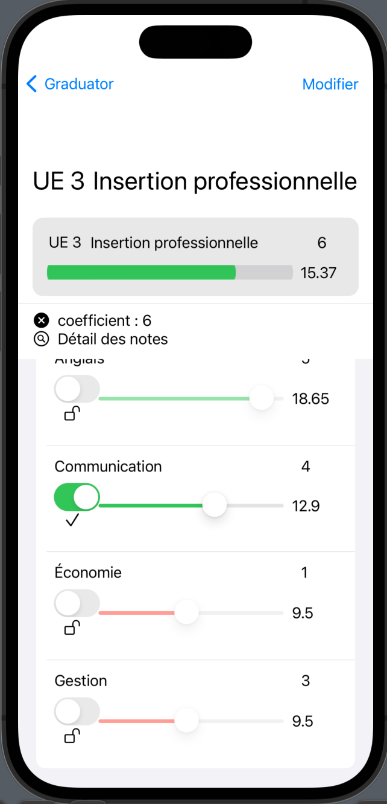

After a grade was changed, in order to save the change and to see it reflected in the `unit`'s weighted average, users need to use the (`lock.open` previously) `checkmark` toggle.

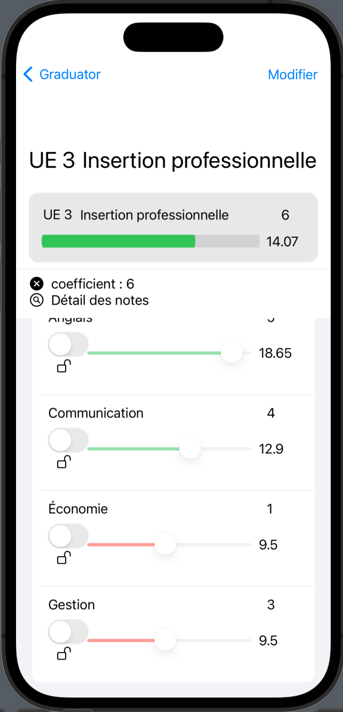

### Creating a `Subject`

Finally, users can create  a `subject` when in edit mode. After clicking on *'Modifier'*, look for a `+` in the top navigation bar.

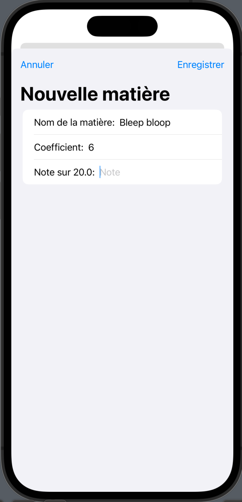
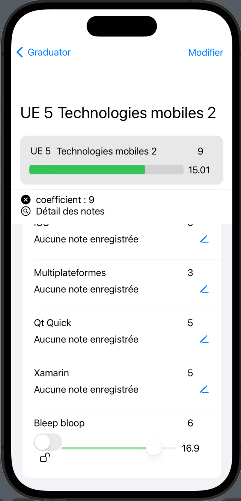
 

## Architecture

Graduator is based on the MVVM (Model-View-ViewModel) architectural pattern. The below UML class diagram details
the structure of the models, viewmodels, and views for `UnitsManager`, `Unit`, and `Subject`. Notice how,
to circumvent [this issue](https://codefirst.iut.uca.fr/documentation/mchSamples_Apple/docusaurus/iOS_MVVM_guide/docs/viewModels/changeNotifications/problematic/),
we insert an entire hierarchy of VMs in certain views, so that they can update all those VMs when a detail gets edited. It's dirty, and it's staying that way for the foreseeable future.

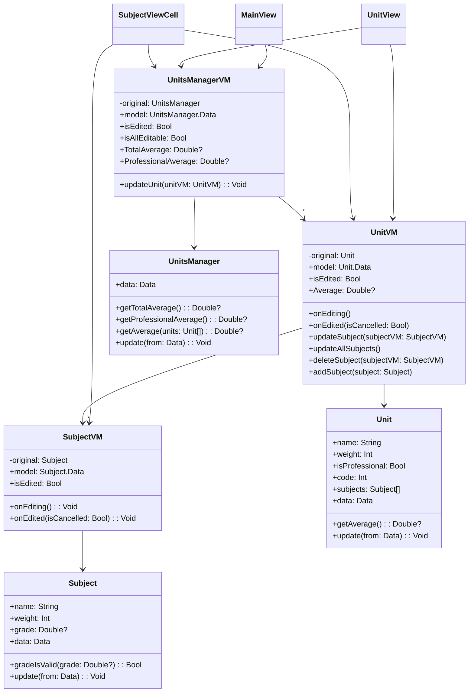

It might be useful to note that, just like `UnitVM`s aggregate `SubjectVM`s, `Unit`s aggregate
`Subject`s, but these relationship between `Model` entities were removed from the diagram above for clarity.
The same is true with the `View`-related classes.

Here is the diagram with those relationships depicted, and the local persistence solution added.

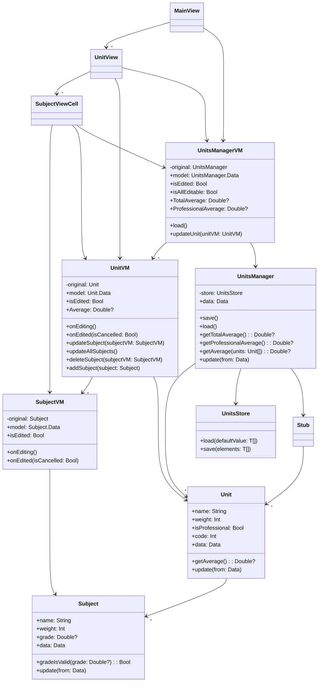
