# Graduator

Graduator is an iOS application developed with SwiftUI that helps users manage their academic `units`, `subjects`, and grades. Users can add and delete `subjects`, edit the weight and name of `subjects` and `units`, and input grades. The app displays weighted averages and explains the conditions for graduating from the Clermont Auvergne Tech Institute's mobile development BSc in 2023.

## Features

Beyond those basic features, some details need to be specified here.

### isCalled Feature

The isCalled property, available for each subject, denotes whether the grade of a specific subject has been called or not -- i.e., whether it is a definitive grade or a temporary one.

From the user's point of view, they can see an image of a snowflake that turns from gray to primary color when a subject grade has been called. A Toggle control allows them to set or unset the isCalled status. If they attempt to change the grade of a subject that has been called, they will not be able to -- the corresponding slider and textfield will remain disabled.

In the model and view model, the `isCalled` property of `subjects` affects the state of their `unit`. If all of a `unit`'s `subject` grades are called, the `unit` is considered called too. Note that if a `subject`'s grade is not set (nil), the `subject` can't be called.

### Deleting a Subject

In the app, users can delete a subject by swiping it off the list, right-to-left.

Note that when a subject is deleted, it is permanently removed from the system. If a user is in the process of editing and deletes a subject, the deletion occurs immediately upon swiping, not when they save (click 'OK'). If the user chooses to cancel their edits (click 'Annuler'), all other unsaved changes will be discarded, but the deletion of the subject remains.

### Changing a grade

Before a user changes a grade, they first need to activate the `lock.open` toggle. If the grade is *called*, they also need to use the `isCalled` toggle.

After a grade was changed, in order to save the change and to see it reflected iun the weighted average, users need to use the (previously `lock.open`, now) `checkmark` toggle.

## Architecture

Graduator is based on the MVVM (Model-View-ViewModel) architectural pattern. The below UML class diagram details the structure of the models, viewmodels, and views for `UnitsManager`, `Unit`, and `Subject`.

It might be useful to note that, just like `UnitVM`s aggregate `SubjectVM`s, `Unit`s aggregate `Subject`s, but these relationship between `Model` entities were removed from the diagram above for clarity. 

Here is the diagram with those relationships depicted.

```mermaid
classDiagram
    class Unit {
        +name: String
        +weight: Int
        +isProfessional: Bool
        +code: Int
        +subjects: [Subject]
        +getAverage(): Double?
        +data: Data
        +update(from: Data): Void
    }

    class UnitVM {
        -original: Unit
        +model: Unit.Data
        +isEdited: Bool
        +SubjectsVM: [SubjectVM]
        +onEditing(): Void
        +onEdited(isCancelled: Bool): Void
        +updateSubject(subjectVM: SubjectVM): Void
        +updateAllSubjects(): Void
        +deleteSubject(subjectVM: SubjectVM): Void
        +addSubject(subject: Subject): Void
        +Average: Double?
        +IsCalled: Bool
    }

    class UnitView {
        -unitVM: UnitVM
        -unitsManagerVM: UnitsManagerVM
        +delete(at: IndexSet): Void
    }

    class Subject {
        +name: String
        +weight: Int
        +grade: Double?
        +isCalled: Bool
        +gradeIsValid(grade: Double?): Bool
        +data: Data
        +update(from: Data): Void
    }

    class SubjectVM {
        -original: Subject
        +model: Subject.Data
        +isEdited: Bool
        +onEditing(): Void
        +onEdited(isCancelled: Bool): Void
    }

    class SubjectViewCell {
        -subjectVM: SubjectVM
        -unitVM: UnitVM
        -unitsManagerVM: UnitsManagerVM
        -isGradeEditable: Bool
    }

    class UnitsManager {
        +units: [Unit]
        +getTotalAverage(): Double?
        +getProfessionalAverage(): Double?
        +getAverage(units: [Unit]): Double?
        +data: Data
        +update(from: Data): Void
    }

    class UnitsManagerVM {
        -original: UnitsManager
        +model: UnitsManager.Data
        +isEdited: Bool
        +isAllEditable: Bool
        +UnitsVM: [UnitVM]
        +updateUnit(unitVM: UnitVM): Void
        +TotalAverage: Double?
        +ProfessionalAverage: Double?
    }

    class MainView {
        -unitsManagerVM: UnitsManagerVM
    }

    UnitVM -- Unit : Uses
    UnitView -- UnitVM : Observes
    SubjectVM -- Subject : Uses
    SubjectViewCell -- SubjectVM : Observes
    UnitVM "1" o-- "*" SubjectVM : Contains
    Unit "1" o-- "*" Subject : Contains
    UnitsManagerVM -- UnitsManager : Uses
    UnitsManagerVM "1" o-- "*" UnitVM : Contains
    UnitsManager "1" o-- "*" Unit : Contains
    MainView -- UnitsManagerVM : Observes
```

